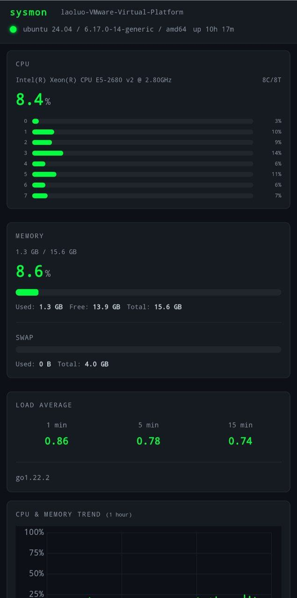

# sysmon

English | [中文](#中文)

Lightweight system monitor with a built-in web terminal. Single Go binary, no runtime deps. Runs on Linux, macOS, Windows.




## Features

- **Real-time monitoring** — CPU, memory, disk, network, load average, all via WebSocket
- **Process list** — sortable by CPU/memory/PID
- **History charts** — CPU & memory trends over time (configurable retention)
- **Docker containers** — auto-detects and shows container stats
- **Web Terminal (WebShell)** — full PTY terminal in your browser, powered by xterm.js
- **Password auth** — optional login with HMAC-SHA256 tokens
- **Separate shell password** — terminal access has its own password, independent from the monitor login
- **Dark terminal UI** — monospace, responsive, works on phones
- **Single binary** — frontend assets embedded, just run it

## Quick Start

### One-line install (Linux / macOS)

```bash
bash <(curl -sL https://raw.githubusercontent.com/xiaoxinmm/sysmon/master/install.sh)
```

This downloads the binary, installs to `/usr/local/bin/sysmon`, creates a default config at `/etc/sysmon.json`, and sets up a systemd service.

### Build from source

```bash
git clone https://github.com/xiaoxinmm/sysmon.git
cd sysmon
go build -o sysmon .
./sysmon
```

Open `http://localhost:8888` in your browser.

### With config file

```bash
./sysmon -config sysmon.json
```

### With environment variables

```bash
PORT=9090 SYSMON_PASSWORD=mypass ./sysmon
```

## Configuration

Create a `sysmon.json`:

```json
{
  "port": 8888,
  "refreshInterval": 1500,
  "maxProcesses": 50,
  "password": "",
  "historyDuration": 3600,
  "enableShell": false,
  "shell_password": ""
}
```

| Field | Env Var | Default | Description |
|-------|---------|---------|-------------|
| `port` | `PORT` | `8888` | HTTP listen port |
| `refreshInterval` | `SYSMON_REFRESH` | `1500` | Data push interval (ms) |
| `maxProcesses` | `SYSMON_MAX_PROCS` | `50` | Max processes to display |
| `password` | `SYSMON_PASSWORD` | `""` | Monitor login password (empty = no auth) |
| `historyDuration` | `SYSMON_HISTORY` | `3600` | History data retention (seconds) |
| `enableShell` | — | `false` | Enable the web terminal feature |
| `shell_password` | — | `""` | Password for web terminal (must be set if enableShell is true) |

## Security

The web terminal is off by default. To use it:

1. Set `enableShell` to `true` in your config
2. Set `shell_password` to a strong password

Security measures:
- **Dual password** — monitor and terminal have separate passwords. Logging into the dashboard doesn't give terminal access.
- **Shell token expiry** — terminal auth tokens expire after 1 hour. You'll need to re-authenticate.
- **Session storage** — tokens are stored in sessionStorage (cleared when you close the tab)
- **Both required** — `enableShell` must be `true` AND `shell_password` must be non-empty for the terminal to work

> ⚠️ The web terminal gives full shell access to the machine sysmon is running on. Use strong passwords and don't expose it to the public internet without additional protection (VPN, firewall, etc).

## License

AGPL-3.0. See [LICENSE](LICENSE).

---

# 中文

[English](#sysmon) | 中文

轻量系统监控 + Web 终端，Go 单文件部署，不依赖任何运行时环境。支持 Linux、macOS、Windows。


## 功能

- **实时监控** — CPU、内存、磁盘、网络、负载，全部走 WebSocket 推送
- **进程列表** — 按 CPU / 内存 / PID 排序
- **历史图表** — CPU 和内存使用率趋势，保留时长可配置
- **Docker 容器** — 自动检测并展示容器状态
- **Web 终端 (WebShell)** — 浏览器里直接用终端，基于 xterm.js + PTY
- **密码认证** — 可选的登录认证，HMAC-SHA256 token
- **独立终端密码** — 终端访问用单独的密码，和监控登录密码互不影响
- **暗色终端风格 UI** — 等宽字体，响应式，手机也能用
- **单文件部署** — 前端资源全嵌入二进制，丢上去就能跑

## 快速开始

### 一键安装（Linux / macOS）

```bash
bash <(curl -sL https://raw.githubusercontent.com/xiaoxinmm/sysmon/master/install.sh)
```

自动下载二进制到 `/usr/local/bin/sysmon`，创建默认配置 `/etc/sysmon.json`，配置 systemd 服务。

### 从源码编译

```bash
git clone https://github.com/xiaoxinmm/sysmon.git
cd sysmon
go build -o sysmon .
./sysmon
```

浏览器打开 `http://localhost:8888`。

### 使用配置文件

```bash
./sysmon -config sysmon.json
```

### 使用环境变量

```bash
PORT=9090 SYSMON_PASSWORD=mypass ./sysmon
```

## 配置

创建 `sysmon.json`：

```json
{
  "port": 8888,
  "refreshInterval": 1500,
  "maxProcesses": 50,
  "password": "",
  "historyDuration": 3600,
  "enableShell": false,
  "shell_password": ""
}
```

| 字段 | 环境变量 | 默认值 | 说明 |
|------|---------|--------|------|
| `port` | `PORT` | `8888` | HTTP 监听端口 |
| `refreshInterval` | `SYSMON_REFRESH` | `1500` | 数据推送间隔（毫秒） |
| `maxProcesses` | `SYSMON_MAX_PROCS` | `50` | 最大显示进程数 |
| `password` | `SYSMON_PASSWORD` | `""` | 监控登录密码（空=免登录） |
| `historyDuration` | `SYSMON_HISTORY` | `3600` | 历史数据保留（秒） |
| `enableShell` | — | `false` | 启用 Web 终端 |
| `shell_password` | — | `""` | Web 终端密码（enableShell 为 true 时必须设置） |

## 安全说明

Web 终端默认关闭。要启用的话：

1. 配置文件里 `enableShell` 设为 `true`
2. `shell_password` 设一个强密码

安全机制：
- **双密码隔离** — 监控和终端使用不同密码，登录仪表盘不等于拿到终端权限
- **Token 过期** — 终端认证 token 1 小时后过期，需要重新输入密码
- **sessionStorage** — token 存在 sessionStorage 里，关闭标签页就没了
- **双条件校验** — `enableShell` 必须为 true 且 `shell_password` 不为空，终端才会启用

> ⚠️ Web 终端会给你 sysmon 所在机器的完整 shell 权限。请设置强密码，不要在公网裸奔（建议配合 VPN / 防火墙使用）。

## 许可证

AGPL-3.0，详见 [LICENSE](LICENSE)。
