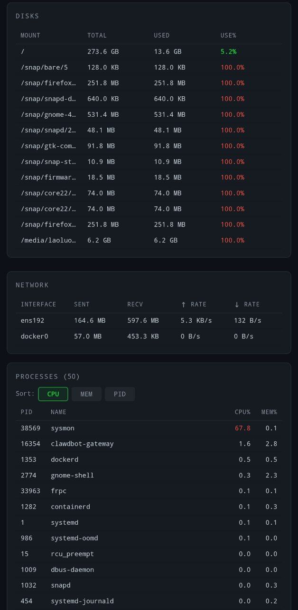

# sysmon

[English](README.md) | 中文

轻量级实时系统监控工具，终端风格 Web UI。Go 编写，单文件部署，零运行时依赖。



## 功能

- **实时监控** — CPU、内存、磁盘、网络、系统负载
- **进程列表** — 按 CPU / 内存 / PID 排序
- **历史图表** — CPU 和内存使用率趋势（时长可配置）
- **Docker 容器** — 有 Docker 的话自动展示容器状态
- **密码认证** — 可选，基于 HMAC-SHA256 的 token 认证
- **暗色主题** — 等宽字体，终端风格
- **移动端适配** — 手机平板都能看
- **单文件部署** — 前端资源全部嵌入二进制
- **灵活配置** — 支持 JSON 配置文件 + 环境变量覆盖

## 快速开始

```bash
go build -o sysmon .
./sysmon
```

浏览器打开 `http://localhost:8888`。

### 使用配置文件

```bash
./sysmon -config sysmon.json
```

### 使用环境变量

```bash
PORT=9090 SYSMON_PASSWORD=secret ./sysmon
```

## 配置

创建 `sysmon.json`（参考 `sysmon.example.json`）：

```json
{
  "port": 8888,
  "refreshInterval": 1500,
  "maxProcesses": 50,
  "password": "",
  "historyDuration": 3600
}
```

| 字段 | 环境变量 | 默认值 | 说明 |
|------|---------|--------|------|
| `port` | `PORT` | `8888` | HTTP 监听端口 |
| `refreshInterval` | `SYSMON_REFRESH` | `1500` | 数据推送间隔（毫秒） |
| `maxProcesses` | `SYSMON_MAX_PROCS` | `50` | 显示的最大进程数 |
| `password` | `SYSMON_PASSWORD` | `""` | 认证密码（空=不需要认证） |
| `historyDuration` | `SYSMON_HISTORY` | `3600` | 历史数据保留时长（秒） |

## 许可证

AGPL-3.0，详见 [LICENSE](LICENSE)。
